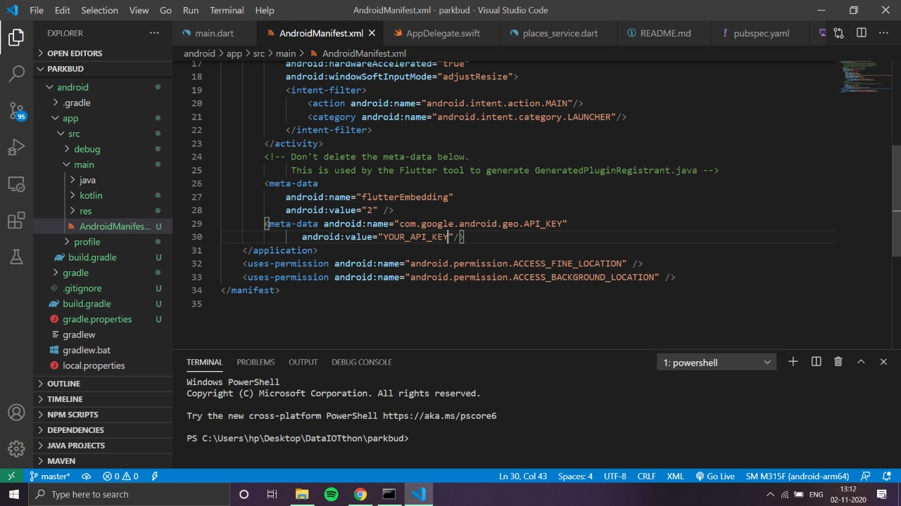
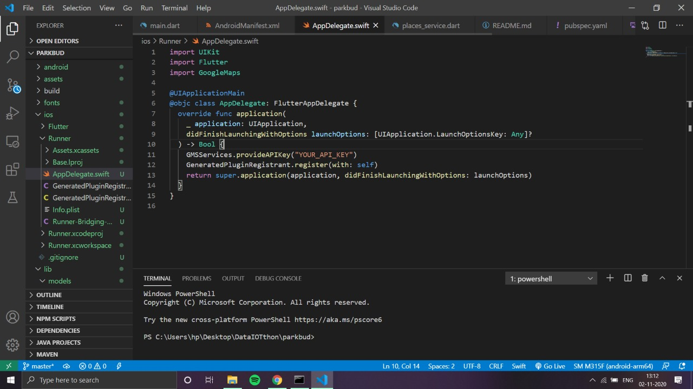
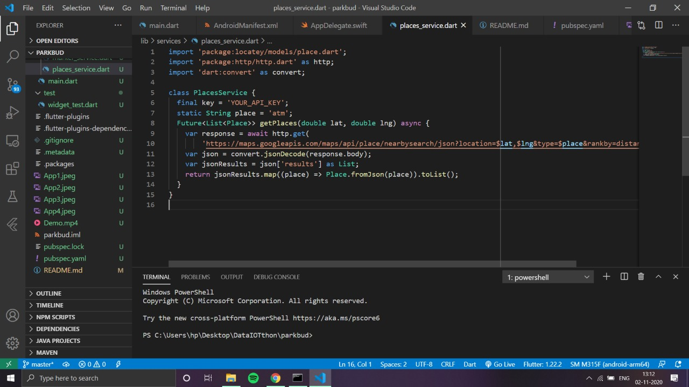
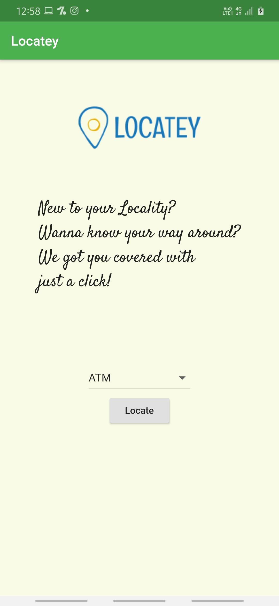
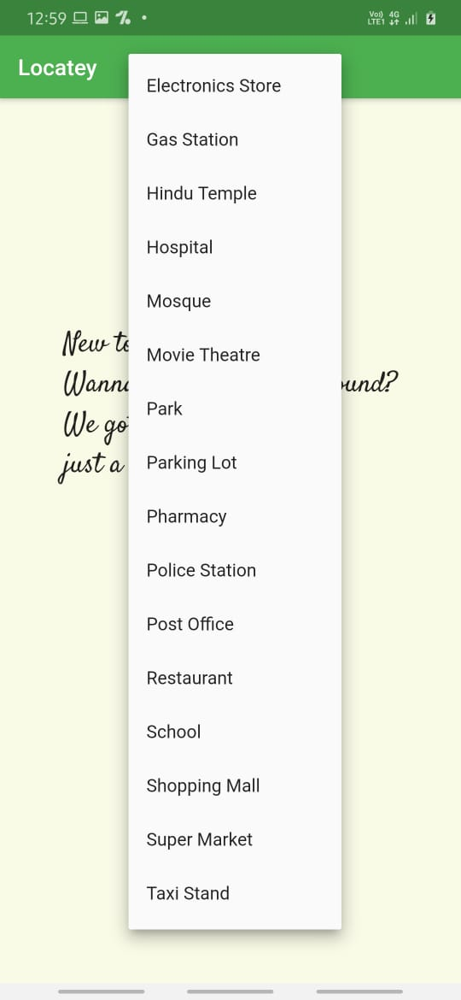
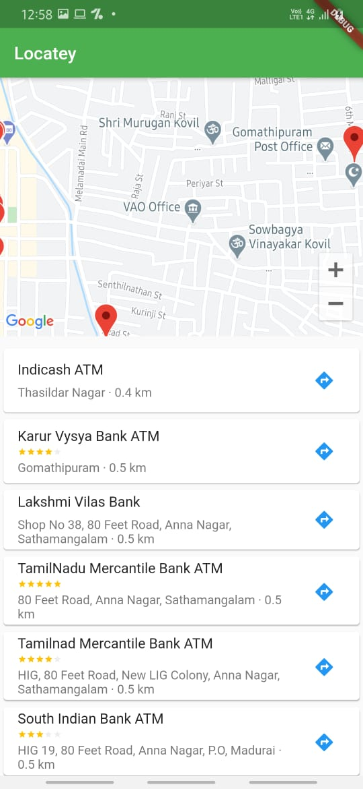
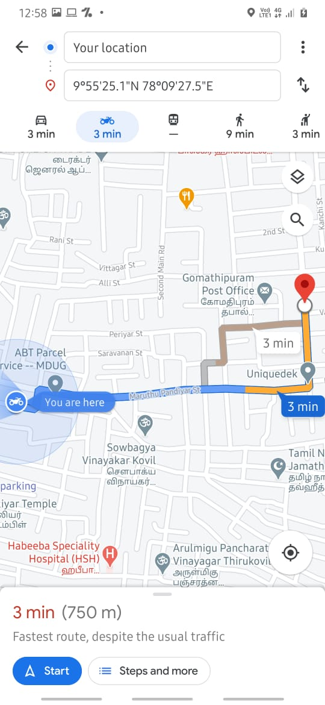

# locatey

A new Flutter project.

This project helps you to locate ATMS, Banks, Hospitals, Theatres etc. nearby your current 
location for people using the Google Places API and is also linked with Google Maps to get
directions to the respective location.

Changes to be Made while cloning:
Add your Google Cloud API Key in: 
    android\app\src\main\AndroidManifest.xml 
    ios\Runner\AppDelegate.swift
    lib\services\places_service.dart
    
Replace "Your_API_Key" with your Google Cloud API Key:

## Getting Started

This project is a starting point for a Flutter application.

A few resources to get you started if this is your first Flutter project:

- [Lab: Write your first Flutter app](https://flutter.dev/docs/get-started/codelab)
- [Cookbook: Useful Flutter samples](https://flutter.dev/docs/cookbook)

For help getting started with Flutter, view our
[online documentation](https://flutter.dev/docs), which offers tutorials,
samples, guidance on mobile development, and a full API reference.

  
  

  
  

